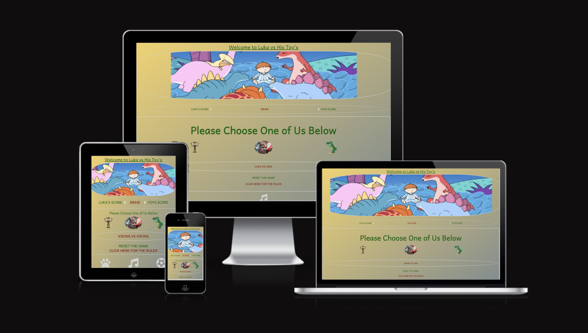
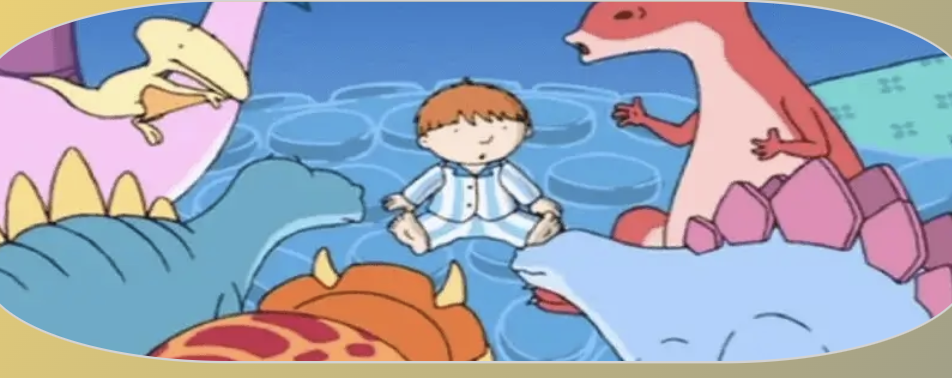
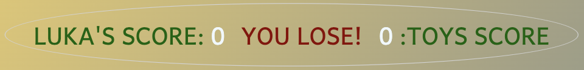
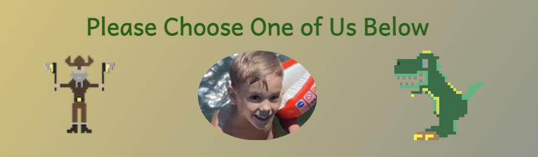

# LUKA VS TOYS

The Luka vs Toys (LVT) website is typically aimed for a child aged between 4 & 6 years old, with bespoke elements to that child. These elements can be changed depending on the client. In this instance the client’s child is a 5-year old boy named ‘Luka’. The bespoke elements for this website are a Paper, Rock, Scissors styled game that has been substituted for a Viking, Dino, and the child himself Luka. LVT includes a game for the child, that keeps score against the computer, also gives the child easy access to their favourite interests such as cartoons, music, and football team.

LVT is a simple to use website that can be used on a mobile, tablet, or computer and designed with a child in mind. Please see UX section for more detail for the bespoke design.

## UX

For the design of LVT I had to take account of what the client wanted:
-   Include favourite colours such as Red, Green, Yellow, and Grey.
-   Include the favourite toys, The Viking, The Dino.
-   Make it personal to the child.
-   Add any extra features than just the game.

### Colour Scheme

The background colour I used a linear gradient starting with a warm Yellow into a cool Grey, going from the top left to the bottom right. It gives a certain day to night feel to the LVT. Also contrasts well with the other colours.

For the main text I used a Dark Red and a Dark Green. These colours stand out very well with the background colour also it hits one of the client’s design criteria (the child’s favourite colours)

For the icons at the footer, I used a light grey as the background colour gets darker nearer the bottom of LVT.

### Typography

The use of the ‘Andika’ font was primarily used due to it’s more fun appearance. As LVT is designed for a child it is less formal, however it is still clear and easy to read.

-	[Andika](https://fonts.googleapis.com/css2?family=Andika&display=swap) was used for all the text in LVT.

The icons used for the links were chosen as they best indicate what the child’s interests are.

-   [Font Awesome](https://fontawesome.com) icons were used as the ‘youTube’ icons in the footer.

## Features

### Title

-	Featured at the top of the page, it is in the centre and underlined like you would do if you were doing some homework.
-	The font makes it less formal and friendlier for the user.
-	The Dark Green makes it stand out and goes well with the background colour.

### Hero Image

-	The hero image is playful, imaginative and appeals to a young child.
-	The rounded border gives it a softer look and a feel of looking through a telescope. A child on an adventure. 

### Score Board

-	The rounded border is in keeping with the hero image and breaks up the LVT. The light grey colour used compliments the background.
-	The score board automatically updates the score. It also tells the user whether they ‘Won, Lose, or Draw’.
-	Green, Aliceblue, Red colours were used for the font. This was to make it clear who was playing, what the score is, and what the result was. Also in keeping with the clients wishes of having the child’s favourite colour being used. 

### Game Icons

-	The text above the icons is to make it clear that you can choose them.
-	The Viking and Dino Icons are bespoke for the child, designed using pixel art.
-	The image of the child was placed in the centre and is slightly larger than the other two icons. This is to personalise LVT.
-	On clicking one of the three icons it will initiate the start of the game. The score board and results will be updated above. Below the players choice and the computers random choice will be displayed.  

