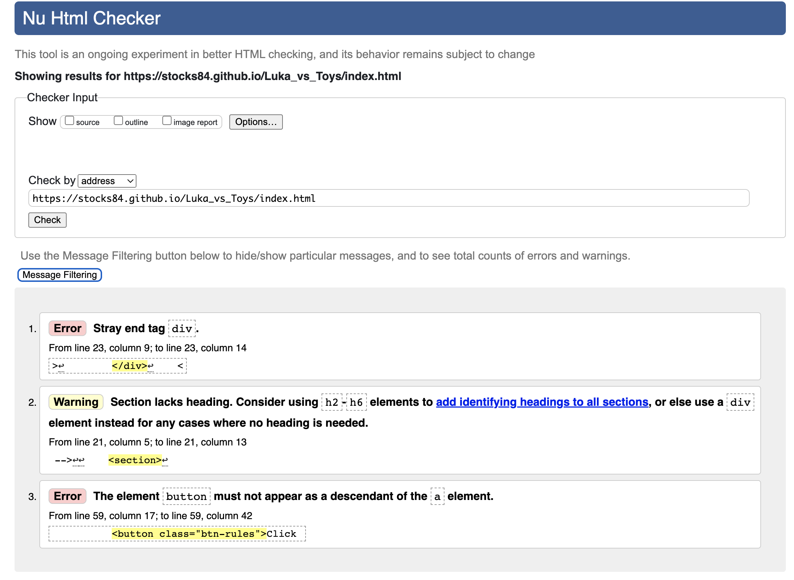
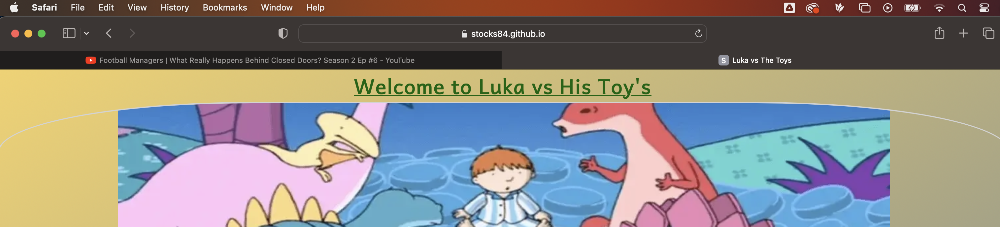
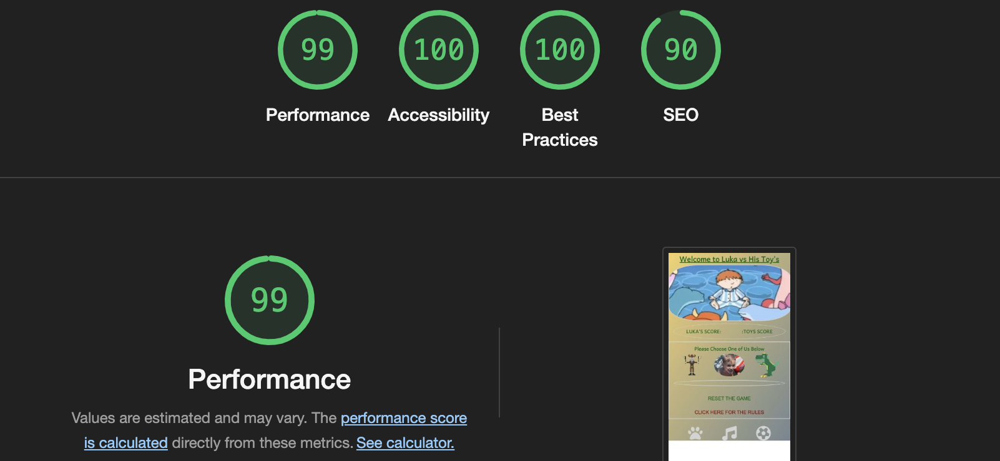

# LUKA VS TOYS

The Luka vs Toys (LVT) website is typically aimed for a child aged between 4 & 6 years old, with bespoke elements to that child. These elements can be changed depending on the client. In this instance the client’s child is a 5-year old boy named ‘Luka’. The bespoke elements for this website are a Paper, Rock, Scissors styled game that has been substituted for a Viking, Dino, and the child himself Luka. LVT includes a game for the child, that keeps score against the computer, also gives the child easy access to their favourite interests such as cartoons, music, and football team.

LVT is a simple to use website that can be used on a mobile, tablet, or computer and designed with a child in mind. Please see UX section for more detail for the bespoke design.

## UX

For the design of LVT I had to take account of what the client wanted:
-   Include favourite colours such as Red, Green, Yellow, and Grey.
-   Include the favourite toys, The Viking, The Dino.
-   Make it personal to the child.
-   Add any extra features than just the game.

### Colour Scheme

The background colour I used a linear gradient starting with a warm Yellow into a cool Grey, going from the top left to the bottom right. It gives a certain day to night feel to the LVT. Also contrasts well with the other colours.

For the main text I used a Dark Red and a Dark Green. These colours stand out very well with the background colour also it hits one of the client’s design criteria (the child’s favourite colours)

For the icons at the footer, I used a light grey as the background colour gets darker nearer the bottom of LVT.

### Typography

The use of the ‘Andika’ font was primarily used due to it’s more fun appearance. As LVT is designed for a child it is less formal, however it is still clear and easy to read.

-	[Andika](https://fonts.googleapis.com/css2?family=Andika&display=swap) was used for all the text in LVT.

The icons used for the links were chosen as they best indicate what the child’s interests are.

-   [Font Awesome](https://fontawesome.com) icons were used as the ‘youTube’ icons in the footer.

## Features

### Title

-	Featured at the top of the page, it is in the centre and underlined like you would do if you were doing some homework.
-	The font makes it less formal and friendlier for the user.
-	The Dark Green makes it stand out and goes well with the background colour.

### Hero Image

-	The hero image is playful, imaginative and appeals to a young child.
-	The rounded border gives it a softer look and a feel of looking through a telescope. A child on an adventure. 

### Score Board

-	The rounded border is in keeping with the hero image and breaks up the LVT. The light grey colour used compliments the background.
-	The score board automatically updates the score. It also tells the user whether they ‘Won, Lose, or Draw’.
-	Green, Aliceblue, Red colours were used for the font. This was to make it clear who was playing, what the score is, and what the result was. Also in keeping with the clients wishes of having the child’s favourite colour being used. 

### Game Icons

-	The text above the icons is to make it clear that you can choose them.
-	The Viking and Dino Icons are bespoke for the child, designed using pixel art.
-	The image of the child was placed in the centre and is slightly larger than the other two icons. This is to personalise LVT.
-	On clicking one of the three icons it will initiate the start of the game. The score board and results will be updated above. Below the players choice and the computers random choice will be displayed.  

### Choice Area

-	The rounded border in keeping with the LVT.
-	Once a game icon is clicked the players choice and computers random choice will automatically appear. This will make it clear what choices were made and why the result was given.
-	The colour was used to break the LVT up and make it clear that this is the choice area.

### Buttons

-	First button resets the game.
-	Second button takes you to the rules page.
-	Both buttons large and clear.

### Navigation Links

-	This feature is the extra content.
-	Each icon links to a ‘youTube’ playlist that the child likes.
-	The first icon is reference to ‘Paw Patrol’, the second to ‘music’, and the third to the child favourite football team highlights.
-	The icons are large and in Light Gray so they stand out clearly. 

### Rules Page

-	This page is mainly for the adults, so they describe to the child how the game works and how to use the features.
-	Two ways to return to the game page.
-	First the title is linked back to the game for easy access.

-	Second the button labelled ‘Game Page’.

## Future Features

### Gallery Page

-	This would allow the child to see all the images of the good times they have had. Adding to that personal feel.

### Games

-	Add more games in the future and allow the site to evolve.
-	More challenging games as the child grows older. 

# Testing

## Code Validation

### HTML

I have used the recommended [HTML W3C Validator](https://validator.w3.org) to validate all of my HTML files.

| Page | W3C URL | Screenshot | Notes |
| --- | --- | --- | --- |
| Home | [W3C](https://validator.w3.org/nu/?doc=https%3A%2F%2Fstocks84.github.io%2FLuka_vs_Toys%2Findex.html) |  | Section lacks header h2-h6 warning and fixed |
| Rules Page | [W3C](https://validator.w3.org/nu/?doc=https%3A%2F%2FStocks84.github.io%2FLuka_vs_Toys%2Fcontact.html) |  | Section lacks header h2-h6 warning and fixed  |

### CSS

I have used the recommended [CSS Jigsaw Validator](https://jigsaw.w3.org/css-validator) to validate all of my CSS files.

| File | Jigsaw URL | Screenshot | Notes |
| --- | --- | --- | --- |
| style.css | [Jigsaw](https://jigsaw.w3.org/css-validator/validator?uri=https%3A%2F%2FStocks84.github.io%2FLuka_vs_Toys) |  | Pass: No Errors |

### JavaScript

I have used the recommended [JShint Validator](https://jshint.com) to validate all of my JS files.

| File | Screenshot | Notes |
| --- | --- | --- |
| script.js |  | ? |

## Browser Compatibility

I've tested my deployed project on multiple browsers to check for compatibility issues.

| Browser | Screenshot | Notes |
| --- | --- | --- |
| Chrome |  | Works as expected |
| Firefox |  | Works as expected |
| Safari |  | Works as expected |

## Responsiveness

I've tested my deployed project on multiple devices to check for responsiveness issues.

| Device | Screenshot | Notes |
| --- | --- | --- |
| Mobile (DevTools) |  | Works as expected |
| Tablet (DevTools) |  | Works as expected |
| Desktop |  | Works as expected |

## Lighthouse Audit

I've tested my deployed project using the Lighthouse Audit tool to check for any major issues.

| Page | Size | Screenshot | Notes |
| --- | --- | --- | --- |
| Home | Mobile |  | Some minor warnings |
| Home | Desktop |  | Few warnings |
| Rules | Mobile |  | Some minor warnings |
| Rules | Desktop |  | Few warnings |

## Bugs

## Unfixed Bugs

There are no remaining bugs that I am aware of.

## Deployment

The site was deployed to GitHub Pages. The steps to deploy are as follows:
- In the [GitHub repository](https://github.com/Stocks84/Luka_vs_Toys), navigate to the Settings tab 
- From the source section drop-down menu, select the **Main** Branch, then click "Save".
- The page will be automatically refreshed with a detailed ribbon display to indicate the successful deployment.

The live link can be found [here](https://stocks84.github.io/Luka_vs_Toys)
